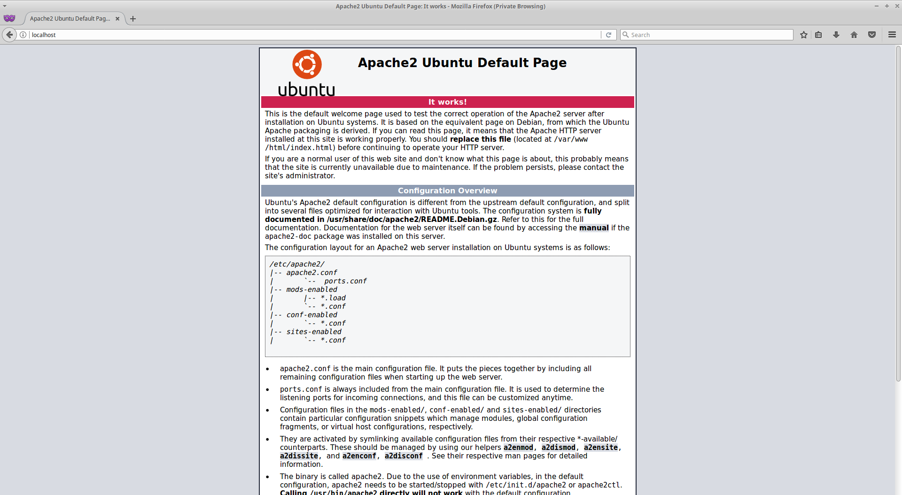
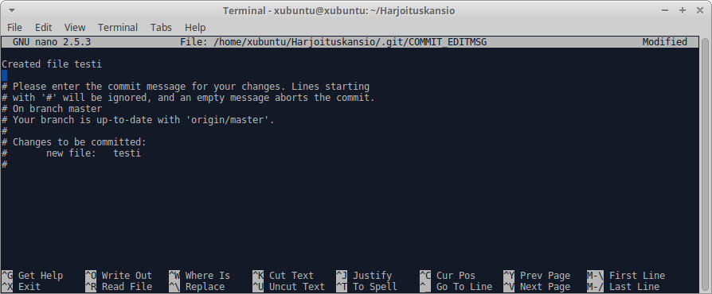
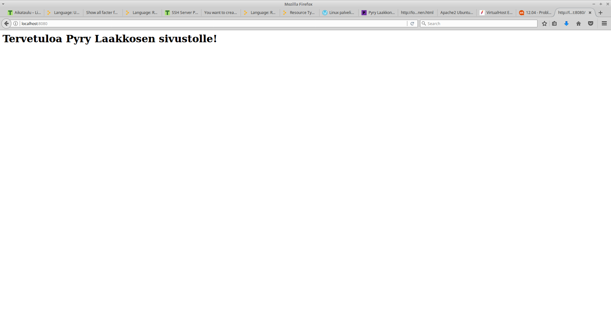

# Linux keskitetty hallinta H2

Lähde: http://terokarvinen.com/2017/aikataulu-%e2%80%93-linuxin-keskitetty-hallinta-%e2%80%93-ict4tn011-11-%e2%80%93-loppukevat-2017-p2

## Alkutietoja
Tämä tehtävä tehtiin Ubuntu 16.04 Live USB:llä

Tehtävän tekemiseen meni aikaan noin 4h

Tietokoneen tiedot:

## Asenna ja konfiguroi jokin palvelin package-file-service -tyyliin Puppetilla.

Tässä tehtävässä aion muokata apache2 default-vhost conf-tiedostoa. Sitä varten täytyy asentaa apache2 komennolla

	sudo apt-get install apache2

Tarkistin, että apache2 toimii.

Asennetaan Puppet blogini ohjeilla.
Lähde: https://www.pyrylaakkonen.com/linux-keskitetty-hallinta-kotitehtava-1/

Mennään Puppetin asetukset-hakemiston Moduuli-hakemistoon komennolla

	cd /etc/puppet/modules

Tehdään uusi moduuli-kansio komennolla

	sudo mkdir -p pyrylaakkonensite/manifests/

Tehdään myös templates kansio

	sudo mkdir pyrylaakkonensite/templates

Kopioidaan apache2 default sivun conf-tiedosto templates hakemistoon, jotta sitä voidaan muokata. Lisäksi kopioidaan se varmuuskopiona toiseen kansioon, jos jotain menee pieleen.

	sudo cp /etc/apache2/sites-available/000-default.conf /etc/puppet/modules/pyrylaakkonensite/templates

	mkdir /home/xubuntu/varmuuskopiot

	sudo cp /etc/apache2/sites-available/000-default.conf /home/xubuntu/varmuuskopiot 

Tämän jälkeen voidaan aloittaa moduulin init.pp tiedoston luominen

	sudoedit manifests/init.pp

	
	class pyrylaakkonensite {
        package { 'apache2':
                ensure => installed,
                name => "apache2",
                allowcdrom => "true",
        }

        file { '/var/www/sivusto':
                ensure => 'directory',
                require => Package["apache2"],
                before => File['/var/www/sivusto/index.html'],
        }

        file { '/var/www/sivusto/index.html':
                content => "<h1>Tervetuloa Pyry Laakkosen sivustolle!</h1>",
                require => Package["apache2"],
        }

        file { '/etc/apache2/sites-available/pyrylaakkonen.conf':
                content => template('pyrylaakkonensite/pyrylaakkonen.conf'),
                require => [ Package["apache2"], File['/var/www/sivusto'], File['/var/www/sivusto/index.html'] ],
                notify => Service["apache2"],
        }

        service { 'apache2':
                ensure => "running",
                enable => "true",
                require => Package["apache2"],
        }
        exec { "sudo a2ensite pyrylaakkonen.conf":
                command => 'sudo a2ensite pyrylaakkonen.conf',
                path => ["/usr/bin", "/usr/sbin"],
                require => [ Package['apache2'], File['/etc/apache2/sites-available/pyrylaakkonen.conf'] ],
                notify => Service["apache2"],
        }
	}

Lähteet tehtyihin asioihin: 

http://terokarvinen.com/2013/hello-puppet-revisited-%E2%80%93-on-ubuntu-12-04-lts

http://stackoverflow.com/questions/22293160/multiple-puppet-requires

https://docs.puppet.com/puppet/latest/lang_relationships.html#packagefileservice

http://terokarvinen.com/2013/ssh-server-puppet-module-for-ubuntu-12-04

https://www.puppetcookbook.com/posts/creating-a-directory.html

https://docs.puppet.com/puppet/3.8/lang_relationships.html

https://docs.puppet.com/puppet/3.8/types/package.html

Tämän jälkeen muokataan vielä vaihdetaan templaten nimi oikeaksi ja tehdään templateen halutut muutokset

	sudo mv /etc/puppet/modules/pyrylaakkonensite/templates/000-default.conf /etc/puppet/modules/pyrylaakkonensite/templates/pyrylaakkonen.conf

	nano pyrylaakkonensite/templates/pyrylaakkonen.conf

	Listen 8080
	<VirtualHost *:8080>
        # The ServerName directive sets the request scheme, hostname and port that
        # the server uses to identify itself. This is used when creating
        # redirection URLs. In the context of virtual hosts, the ServerName
        # specifies what hostname must appear in the request's Host: header to
        # match this virtual host. For the default virtual host (this file) this
        # value is not decisive as it is used as a last resort host regardless.
        # However, you must set it for any further virtual host explicitly.
        #ServerName www.example.com

        ServerAdmin webmaster@localhost
        DocumentRoot /var/www/sivusto

        # Available loglevels: trace8, ..., trace1, debug, info, notice, warn,
        # error, crit, alert, emerg.
        # It is also possible to configure the loglevel for particular
        # modules, e.g.
        #LogLevel info ssl:warn

        ErrorLog ${APACHE_LOG_DIR}/error.log
        CustomLog ${APACHE_LOG_DIR}/access.log combined

        # For most configuration files from conf-available/, which are
        # enabled or disabled at a global level, it is possible to
        # include a line for only one particular virtual host. For example the
        # following line enables the CGI configuration for this host only
        # after it has been globally disabled with "a2disconf".
        #Include conf-available/serve-cgi-bin.conf
	</VirtualHost>

	# vim: syntax=apache ts=4 sw=4 sts=4 sr noet

Käytetyt lähteet:

http://askubuntu.com/questions/416399/problems-with-the-var-www-folder

https://httpd.apache.org/docs/2.4/vhosts/examples.html

https://www.pyrylaakkonen.com/

https://pyrylaakkonen.wordpress.com/2016/10/03/linux-palvelimena-kotitehtava-6/

https://docs.puppet.com/puppet/latest/lang_template.html

	CTRL + x + y

Tämän jälkeen poistetaan apache2, jotta voidaan testata koko moduulin toiminta.

	sudo apt-get purge apache2 && sudo rm -rf /var/www

Tämän jälkeen voidaan suorittaa moduuli Puppetilla komennolla

	sudo puppet apply -e 'class {"pyrylaakkonensite":}'

Lähde: http://terokarvinen.com/2013/hello-puppet-revisited-%E2%80%93-on-ubuntu-12-04-lts

Tämän jälkeen voidaan varmistaa, että sivusto näkyy ja kaikki toimii menemällä selaimeen ja kirjoittamalla localhost:8080.

## Lähteet raportin tekemiseen

http://www.markdowntutorial.com/

http://rmarkdown.rstudio.com/authoring_basics.html

