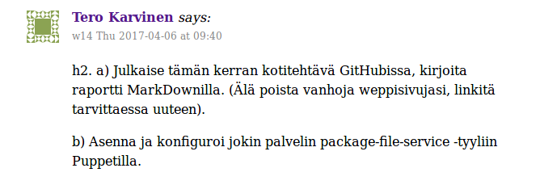
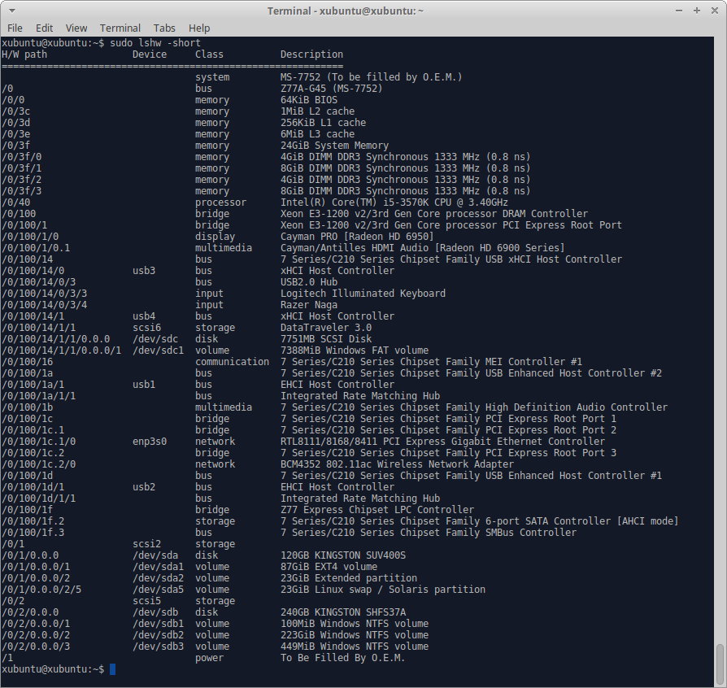

#Linux keskitetty hallinta H2#

Lähde: http://terokarvinen.com/2017/aikataulu-%e2%80%93-linuxin-keskitetty-hallinta-%e2%80%93-ict4tn011-11-%e2%80%93-loppukevat-2017-p2

##Alkutietoja##
Tämä tehtävä tehtiin Ubuntu 16.04 Live USB:llä

Tietokoneen tiedot:

